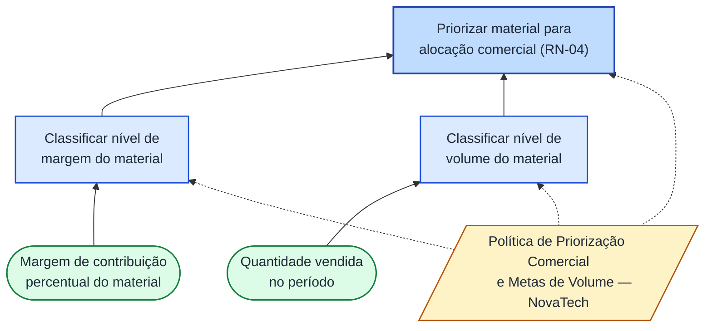

# Atividade Ponderada: Modelagem de Regras de Decisão

**Aluno:** Matheus Henrique Scapolan Silva

**Curso:** Sistemas de Informação, INTELI

**Módulo:** Módulo 7, Sistemas de Gestão e Governança Empresarial

**Frente responsável:** Controladoria (CO), Grupo 2 do projeto, função Apoiar a tomada de decisão

---

## Sumário

1. [Processo selecionado e justificativa](#1-processo-selecionado-e-justificativa)
2. [Vocabulário de referência](#2-vocabulário-de-referência)
3. [Padrão de enunciado adotado](#3-padrão-de-enunciado-adotado)
4. [Catálogo de regras de decisão](#4-catálogo-de-regras-de-decisão)
5. [Modelagem DMN, diagrama de requisitos de decisão](#5-modelagem-dmn-diagrama-de-requisitos-de-decisão)
6. [Tabelas de decisão](#6-tabelas-de-decisão)
7. [Verificação de completude e ausência de conflito](#7-verificação-de-completude-e-ausência-de-conflito)
8. [Síntese e conexão com o projeto](#8-síntese-e-conexão-com-o-projeto)
9. [Referências](#9-referências)
10. [Anexo - Ficha do Catálogo de Regras (planilha)](#anexo--ficha-do-catálogo-de-regras-planilha)

---

## 1. Processo selecionado e justificativa

Dentro do grupo de Controladoria (CO) - do qual eu faço parte -, cada integrante ficou responsável por um processo macro diferente. O processo que peguei foi **Apoiar a tomada de decisão**, que tem como objetivo dar informação para a gestão decidir. Esse processo aparece exemplificado por cinco tipos de decisão: reajustar preços, renegociar fornecedores, revisar descontos comerciais, priorizar produtos mais rentáveis e reduzir custos logísticos. É esse processo, e não a Controladoria inteira, que uso como base para as cinco regras deste catálogo.

Essa escolha também atende ao que o roteiro pede, que é selecionar um processo do caso do parceiro que envolva aprovação ou classificação. As regras que criei classificam algo, um material, um cliente ou um centro de custo, comparando um valor apurado com um limite de referência. A tabela abaixo mostra qual regra cobre qual exemplo de decisão.

| Regra | Decisão gerencial apoiada (exemplo do processo Apoiar a tomada de decisão) |
|---|---|
| RN-01 | Reajustar preços |
| RN-02 | Renegociar fornecedores |
| RN-03 | Revisar descontos comerciais |
| RN-04 | Priorizar produtos mais rentáveis |
| RN-05 | Reduzir custos logísticos |

Essas regras são diferentes de uma regra que só calcula um valor contábil, como a que define qual alíquota de imposto usar em um pedido. Aqui, cada regra pega um valor que já está certo e compara com um parâmetro de referência ao longo do tempo, e só depois disso ela avisa a gestão.

Por isso, quatro das cinco regras são regras de ação (avisam algo) e não restrições (bloqueiam algo). Nenhuma delas impede uma venda, uma vez que elas avisam a gestão, que continua sendo quem decide.

---

## 2. Vocabulário de referência

Antes de escrever as regras, defini o vocabulário usado nelas, seguindo a ideia da norma SBVR, *Semantics of Business Vocabulary and Business Rules*, vista em aula. Cada termo abaixo tem uma única definição. Isso evita que a mesma palavra signifique coisas diferentes em áreas diferentes da empresa, e ajuda a confirmar se a regra realmente pode ser calculada com os dados que a Controladoria da NovaTech tem disponíveis.

| Termo | Definição operacional |
|---|---|
| Material | Produto revendido pela NovaTech, identificado no Material Master e pela característica material do Margin Analysis. |
| Cliente | Parceiro de negócio que compra materiais da NovaTech, cadastrado com papéis Financeiro (FI) e de Vendas (SD). |
| Fornecedor | Parceiro de negócio que fornece materiais à NovaTech, cadastrado com papéis de Compras (MM) e Financeiro (FI). |
| Período de apuração | Intervalo de tempo, mensal ou por ciclo de vendas, usado pela Controladoria para consolidar valores de receita, custo e volume antes de gerar sinalizações de apoio à decisão. |
| Margem de contribuição | Diferença entre a receita e os custos e tributos diretamente associados a um material ou cliente, expressa em percentual sobre a receita. |
| Nível de margem | Classificação do material em alta ou baixa, derivada da comparação entre a margem de contribuição percentual do material e um limiar de referência. |
| Nível de volume | Classificação do material em alto ou baixo, derivada da comparação entre a quantidade vendida no período de apuração e um limiar de referência. |
| Custo médio móvel | Valor de custo do material recalculado a cada entrada de estoque (valorização Moving Average), usado como referência para identificar aumento de custo de aquisição. |
| Custo de referência | Valor do custo médio móvel do material registrado no período de apuração anterior, tomado como base de comparação para identificar variação de custo. |
| Preço de tabela | Preço padrão do material antes da aplicação de descontos, registrado na condição de preço base do pedido de venda. |
| Desconto médio | Percentual médio de redução sobre o preço de tabela concedido a um cliente em um período de apuração, apurado pela condição de desconto por cliente. |
| Centro de custo | Unidade organizacional de Controladoria que agrupa custos por área operacional: Comercial/Vendas, Logística/CD e Administrativo. |
| Custo logístico médio por pedido | Custo total apurado no Centro de Custo Logística/CD em um período de apuração, dividido pelo número de pedidos de venda processados nesse período. |
| Margin Analysis | Relatório de rentabilidade da Controladoria, estruturado pelas características cliente, material, UF e canal de distribuição, base das sinalizações tratadas neste catálogo. |

---

## 3. Padrão de enunciado adotado

As regras foram escritas no formato **"Se [condição], então [efeito]"**. Esse formato é fácil de transformar em linha de tabela de decisão. Além disso, cada regra recebeu uma modalidade: obrigação, proibição, permissão ou necessidade. Isso segue o *Business Rules Manifesto* (Business Rules Group, 2003), onde a regra é declarativa, então pode ser implementada de formas diferentes, por parametrização, fluxo de aprovação ou motor de regras, sem que o enunciado precise mudar. Usei esse mesmo padrão nas cinco regras, sem misturar estilos.

---

## 4. Catálogo de regras de decisão

Das cinco regras, quatro são regras de ação e uma é derivação. Nenhuma delas é restrição, porque apoiar a tomada de decisão não é bloquear nada, é avisar a gestão.

### RN-01 — Obrigação, regra de ação, apoio à decisão de reajustar preços

> Se a margem de contribuição percentual média de um material, calculada por período no relatório de Margin Analysis, ficar abaixo de 25% por dois períodos seguidos, então o material é sinalizado no relatório como candidato a reajuste de preço, para decisão da área comercial.

- **Origem:** política de preços da NovaTech. O valor de 25% e os dois períodos seguidos são parâmetros que foram escolhidos para este exercício para fins de aprendizagem. Eles evitam que uma queda de margem de um mês só já dispare o aviso; isso ainda precisa ser validado com a área comercial se for adotado.
- **Área proprietária:** Controladoria (CO) acompanha a margem ao longo do tempo. Quem decide se o preço muda de verdade é Vendas (SD); a Controladoria só avisa.
- **Implementação sugerida:** relatório periódico do Margin Analysis, filtrando por material, usando os aplicativos Fiori de análise de rentabilidade citados no TAPI. Não precisa de desenvolvimento, ou seja, de extensão em código.

### RN-02 — Obrigação, regra de ação, apoio à decisão de renegociar fornecedores

> Se o custo médio móvel de um material subir mais de 8% em relação ao custo do período anterior, então o material é sinalizado no relatório de Margin Analysis como candidato a renegociação com o fornecedor.

- **Origem:** acompanhamento do custo de compra, usando a valorização por preço médio móvel prevista para a NovaTech. O valor de 8% é um parâmetro que foi escolhido para este exercício.
- **Área proprietária:** Controladoria (CO), junto com Compras (MM), que mantém o registro de condição e o Info Record fornecedor-material usado para comparar o custo.
- **Implementação sugerida:** comparação entre o custo médio móvel atual e o do período anterior; esse cálculo já existe nativamente na valorização do material. Aparece como exceção no relatório de custo, sem precisar de extensão em código.

### RN-03 — Obrigação, regra de ação, apoio à decisão de revisar descontos comerciais

> Se a margem de contribuição percentual média de um cliente, calculada por período no relatório de Margin Analysis, ficar abaixo de 15%, e o desconto médio dado a esse cliente no mesmo período for maior que 8% sobre o preço de tabela, então o cliente é sinalizado como candidato a revisão da política de desconto.

- **Origem:** política de rentabilidade por cliente da NovaTech. Os valores de 15% e de 8% são parâmetros que foram escolhidos para este exercício. As duas condições são usadas juntas para não culpar o desconto quando a margem cai por outro motivo; isso diferencia esta regra da RN-01, que sinaliza o material independentemente da causa.
- **Área proprietária:** Controladoria (CO), junto com Vendas (SD), que revisa as condições de desconto por cliente. O TAPI não diz qual código de condição a NovaTech usa para desconto; a menção a uma condição percentual por cliente aqui é só uma referência de como o SAP SD costuma fazer isso, não uma confirmação de que é assim na NovaTech.
- **Implementação sugerida:** campo derivado no Margin Analysis, por cliente, comparando a margem realizada com o desconto médio do período. Sem necessidade de extensão em código.

### RN-04 — Necessidade, derivação, apoio à decisão de priorizar produtos mais rentáveis

> Se um material tiver, ao mesmo tempo, nível de margem alto e nível de volume alto, então ele é classificado como prioridade máxima para venda no relatório de Margin Analysis.

- **Origem:** forma usual de priorizar produtos em Controladoria, cruzando margem e volume. Os níveis alto e baixo, e os limites usados, estão nas duas decisões auxiliares da seção 5. Essa regra evita um erro comum: priorizar só pelo maior percentual de margem, que pode representar pouco dinheiro se o volume vendido for baixo.
- **Área proprietária:** Controladoria (CO), junto com Vendas (SD), para definir o foco comercial por material.
- **Implementação sugerida:** relatório de classificação cruzada no Margin Analysis, usando material e quantidade vendida. Sem necessidade de extensão em código.

### RN-05 — Obrigação, regra de ação, apoio à decisão de reduzir custos logísticos

> Se o custo logístico médio por pedido no Centro de Custo Logística/CD, em um período, subir mais de 10% em relação ao período anterior, então o Centro de Custo é sinalizado no relatório da Controladoria como prioridade para reduzir custo logístico.

- **Origem:** acompanhamento do custo do Centro de Custo Logística/CD, previsto no TAPI para o grupo de Controladoria. O valor de 10% é um parâmetro que foi escolhido para este exercício.
- **Área proprietária:** Controladoria (CO), junto com Compras (MM), que cuida da operação do centro de distribuição NTSP.
- **Implementação sugerida:** comparação de período a período do custo lançado no Centro de Custo Logística/CD, usando o Cost Center Accounting, nativo do sistema. Aparece como exceção, sem precisar de extensão em código.

---

## 5. Modelagem DMN, diagrama de requisitos de decisão

Escolhi modelar a RN-04, priorizar produtos mais rentáveis, porque é a única regra que depende de dois critérios ao mesmo tempo. Isso faz dela a mais interessante para uma tabela de decisão com ramificação de verdade. A notação DMN, *Decision Model and Notation*, da OMG, organiza o modelo em duas partes: o diagrama de requisitos de decisão (DRD), que mostra quais decisões existem e de onde vêm os dados, e a tabela de decisão, que mostra o resultado de cada combinação de entrada.

Para priorizar um material, preciso saber duas coisas que são se a margem dele é alta ou baixa, e se o volume vendido é alto ou baixo. Por isso, criei duas decisões auxiliares antes da decisão final, sendo que uma classifica o nível de margem, a outra classifica o nível de volume. A decisão final, **Priorizar material para alocação comercial**, só combina esses dois resultados. Assim, cada tabela fica pequena e fácil de conferir, a tabela final tem só quatro linhas, mesmo dependendo de dois critérios. Essa forma de dividir a decisão em partes menores segue a recomendação de Taylor (2016). No diagrama, a fonte de conhecimento, a política de priorização e metas de volume da NovaTech, aparece ligada às duas decisões auxiliares e à decisão final pelas setas tracejadas.

### Diagrama de Requisitos de Decisão (DRD)

O diagrama abaixo segue a mesma notação usada em ferramentas de modelagem DMN, como a [demo.bpmn.io/dmn](https://demo.bpmn.io/dmn/new): **retângulos** para decisões, **losangos** para dados de entrada, um **documento** para a fonte de conhecimento, **setas cheias** para requisito de informação (de onde vem o dado) e **setas tracejadas** para requisito de autoridade (qual política fundamenta a decisão).

**Figura 1.** Diagrama de requisitos de decisão (DRD) da priorização comercial de materiais (RN-04).

**Legenda:**

| Elemento | Forma | Significado |
|---|---|---|
| Decisão | Retângulo | Produz um resultado a partir de entradas (`Classificar nível de margem`, `Classificar nível de volume`, `Priorizar material`) |
| Dado de entrada | Losango arredondado | Informação fornecida ao modelo (`Margem do material`, `Quantidade vendida`) |
| Fonte de conhecimento | Documento | Política ou norma que fundamenta a decisão (`Política de Priorização Comercial e Metas de Volume`) |
| Seta cheia | → | Requisito de informação (a decisão depende desse dado ou dessa outra decisão) |
| Seta tracejada | ⇢ | Requisito de autoridade (a decisão é fundamentada por essa fonte de conhecimento) |

---

## 6. Tabelas de decisão

A primeira decisão auxiliar classifica o nível de margem do material. A tabela 1 usa a política de acionamento **única (U)**, as linhas não se sobrepõem. Nos exemplos numéricos desta seção e da seção 7, uso a margem bruta do material, receita menos custo médio, como uma aproximação da margem de contribuição. Explico o motivo na verificação da tabela, logo abaixo.

Nas tabelas a seguir, sigo o mesmo layout de uma ferramenta DMN como o [demo.bpmn.io/dmn](https://demo.bpmn.io/dmn/new): a primeira linha traz o código da **política de acionamento** (Hit Policy) no canto, seguido das colunas de entrada (**Input**) e saída (**Output**); as demais linhas são as regras da tabela, com os valores escritos em notação FEEL (*Friendly Enough Expression Language*), a linguagem de expressão usada dentro das células do DMN.

### Tabela 1 - Decisão: `Classificar nível de margem do material`

**Política de acionamento: U (Única)**

| # | **Input:** `margemMaterial` (margem de contribuição percentual do material) | **Output:** `nivelMargem` (nível de margem) |
|---|---|---|
| 1 | `< 25` | `"Baixa"` |
| 2 | `>= 25` | `"Alta"` |

*Em linguagem natural: se a margem de contribuição percentual do material for inferior a 25%, o nível de margem é Baixa; se for 25% ou mais, o nível de margem é Alta.*

### Tabela 2 - Decisão: `Classificar nível de volume do material`

A segunda decisão auxiliar classifica o nível de volume vendido no período. A tabela 2 também usa política única.

**Política de acionamento: U (Única)**

| # | **Input:** `quantidadeVendida` (quantidade vendida no período) | **Output:** `nivelVolume` (nível de volume) |
|---|---|---|
| 1 | `< 50` | `"Baixo"` |
| 2 | `>= 50` | `"Alto"` |

*Em linguagem natural: se a quantidade vendida no período for inferior a 50 unidades, o nível de volume é Baixo; se for 50 unidades ou mais, o nível de volume é Alto.*

### Tabela 3 - Decisão final: `Priorizar material para alocação comercial` (RN-04)

A decisão final junta os dois resultados anteriores numa matriz de priorização comercial, também com política única. A última coluna mostra qual regra do catálogo cada linha representa.

**Política de acionamento: U (Única)**

| # | **Input:** `nivelMargem` | **Input:** `nivelVolume` | **Output:** `prioridadeComercial` (classificação de prioridade comercial) | Regra materializada |
|---|---|---|---|---|
| 1 | `"Alta"` | `"Alto"` | `"Prioridade máxima"` | RN-04 |
| 2 | `"Alta"` | `"Baixo"` | `"Prioridade para expansão de volume"` | RN-04 |
| 3 | `"Baixa"` | `"Alto"` | `"Prioridade para revisão de custo ou de preço"` | RN-04 |
| 4 | `"Baixa"` | `"Baixo"` | `"Candidato à descontinuação, sujeito a avaliação estratégica"` | RN-04 |

---

## 7. Verificação de completude e ausência de conflito

A tabela 1 divide a margem de contribuição percentual em duas faixas que não se sobrepõem, com o limite em 25%, incluído na faixa alta. Aqui uso a margem bruta, receita menos custo médio, como aproximação da margem de contribuição, porque o TAPI só traz preço de venda e custo médio por material, não traz o detalhe de impostos e outros custos por unidade vendida. A margem de contribuição completa só dá para calcular quando o modelo for usado em pedidos reais, com o detalhe fiscal de cada venda.

Testei essa fronteira com os três materiais do TAPI. O Notebook NovaBook, preço R$ 4.200,00, custo R$ 3.150,00, tem margem bruta de exatamente 25%, cai bem no limite entre as duas faixas, e como o limite é incluído na faixa alta, ele entra como nível de margem alto. O Monitor NovaView, R$ 980,00 e R$ 690,00, e o Teclado NovaKey, R$ 320,00 e R$ 190,00, têm margens de cerca de 29,6% e 40,6%, também ficam na faixa alta. Ou seja, os três materiais do TAPI ficam acima do piso de 25%. Isso é um achado interessante, uma vez que com esse limite, a margem não diferencia os três materiais entre si, e quem decide a prioridade comercial de verdade é o nível de volume.

A tabela 2 divide a quantidade vendida no período em duas faixas, com limite em 50 unidades. O TAPI não define um volume de referência, então usei esse número como parâmetro de trabalho; ele precisaria ser validado com a área comercial antes de usar o modelo fora deste exercício.

A tabela 3 combina os dois resultados em quatro linhas, cobrindo as quatro combinações possíveis, 2 níveis de margem vezes 2 níveis de volume. Por isso ela é completa e sem conflito, visto que cada linha é uma combinação diferente, e nenhuma combinação de entrada cai em duas linhas ao mesmo tempo.

---

## 8. Síntese e conexão com o projeto

As cinco regras cobrem exatamente as cinco decisões do processo Apoiar a tomada de decisão: RN-01 ajuda a reajustar preços, RN-02 ajuda a renegociar fornecedores, RN-03 ajuda a revisar descontos, RN-04 ajuda a priorizar produtos mais rentáveis, e RN-05 ajuda a reduzir custos logísticos.

Nenhuma dessas regras cria dado novo no sistema, todas usam dados que já existem em outras áreas. RN-01 e RN-03 usam preço e desconto, que são de Vendas (SD). RN-02 e RN-05 usam custo de compra e custo de expedição, acompanhados por Compras (MM). RN-04 usa receita e volume, também de Vendas. O papel da Controladoria aqui é comparar esses dados com um parâmetro de referência ao longo do tempo e avisar a gestão. É exatamente isso que significa apoiar a tomada de decisão, que é dar a informação, sem tomar a decisão no lugar de quem precisa decidir.

---

## 9. Referências

- BUSINESS RULES GROUP. *The Business Rules Manifesto*. 2003.
- OBJECT MANAGEMENT GROUP (OMG). *Decision Model and Notation (DMN)*.
- TAYLOR, J. *Real-World Decision Modeling with DMN*. Meghan-Kiffer Press, 2016.

---

## Anexo - Ficha do Catálogo de Regras (planilha)

Esta seção reproduz, na íntegra, o conteúdo da planilha *Planilha_com_Vocabulário__Regras_e_Tabelas_de_Decisão.xlsx*, entregue junto com esta documentação na raíz do repositório do projeto. A planilha organiza o mesmo material das seções 1 a 7 em formato de ficha de catálogo, com dois campos que não aparecem explicitamente no corpo do texto acima: **processo afetado** e **vigência** de cada regra.

### A.1 Vocabulário controlado

*Idêntico ao vocabulário apresentado na [Seção 2](#2-vocabulário-de-referência); reproduzido aqui para manter a planilha completa.*

| Termo | Definição operacional |
|---|---|
| Material | Produto revendido pela NovaTech, identificado no Material Master e pela característica material do Margin Analysis. |
| Cliente | Parceiro de negócio que compra materiais da NovaTech, cadastrado com papéis Financeiro (FI) e de Vendas (SD). |
| Fornecedor | Parceiro de negócio que fornece materiais à NovaTech, cadastrado com papéis de Compras (MM) e Financeiro (FI). |
| Período de apuração | Intervalo de tempo, mensal ou por ciclo de vendas, usado pela Controladoria para consolidar valores de receita, custo e volume antes de gerar sinalizações de apoio à decisão. |
| Margem de contribuição | Diferença entre a receita e os custos e tributos diretamente associados a um material ou cliente, expressa em percentual sobre a receita. |
| Nível de margem | Classificação do material em alta ou baixa, derivada da comparação entre a margem de contribuição percentual do material e um limiar de referência. |
| Nível de volume | Classificação do material em alto ou baixo, derivada da comparação entre a quantidade vendida no período de apuração e um limiar de referência. |
| Custo médio móvel | Valor de custo do material recalculado a cada entrada de estoque (valorização Moving Average), usado como referência para identificar aumento de custo de aquisição. |
| Custo de referência | Valor do custo médio móvel do material registrado no período de apuração anterior, tomado como base de comparação para identificar variação de custo. |
| Preço de tabela | Preço padrão do material antes da aplicação de descontos, registrado na condição de preço base do pedido de venda. |
| Desconto médio | Percentual médio de redução sobre o preço de tabela concedido a um cliente em um período de apuração, apurado pela condição de desconto por cliente. |
| Centro de custo | Unidade organizacional de Controladoria que agrupa custos por área operacional: Comercial/Vendas, Logística/CD e Administrativo. |
| Custo logístico médio por pedido | Custo total apurado no Centro de Custo Logística/CD em um período de apuração, dividido pelo número de pedidos de venda processados nesse período. |
| Margin Analysis | Relatório de rentabilidade da Controladoria, estruturado pelas características cliente, material, UF e canal de distribuição, base das sinalizações tratadas neste catálogo. |

*Critério de aceitação: nenhuma regra do catálogo usa termo fora desta lista.*

### A.2 Catálogo de regras (ficha completa)

> Processo escolhido: dentro do grupo de Controladoria, cada integrante ficou com um processo macro diferente. O meu foi Apoiar a tomada de decisão, dar informação para a gestão decidir. As cinco decisões gerenciais que esse processo apoia estão listadas abaixo.

#### RN-01

| Campo | Conteúdo |
|---|---|
| **Enunciado** | Se a margem de contribuição percentual média de um material, calculada por período no relatório de Margin Analysis, ficar abaixo de 25% por dois períodos seguidos, então o material é sinalizado no relatório como candidato a reajuste de preço, para decisão da área comercial. |
| **Modalidade** | Obrigação |
| **Categoria** | Regra de ação |
| **Decisão gerencial apoiada** | Reajustar preços |
| **Origem** | Política de preços da NovaTech. O valor de 25% e os dois períodos seguidos são parâmetros que escolhi para este exercício, sujeitos a validação com a área comercial. |
| **Área proprietária / Responsável** | Controladoria (CO) acompanha a margem; quem decide se o preço muda de verdade é Vendas (SD). |
| **Processo afetado** | Apuração de rentabilidade por material no ciclo Order to Cash. |
| **Implementação no ERP e justificativa** | Relatório periódico do Margin Analysis, filtrando por material, usando os aplicativos Fiori de análise de rentabilidade citados no TAPI. Justificativa: não precisa de extensão em código, o dado já existe no Margin Analysis. |
| **Vigência** | Início 06/08/2026. Parâmetros (25%, dois períodos) sujeitos a revisão pela área comercial. |

#### RN-02

| Campo | Conteúdo |
|---|---|
| **Enunciado** | Se o custo médio móvel de um material subir mais de 8% em relação ao custo do período anterior, então o material é sinalizado no relatório de Margin Analysis como candidato a renegociação com o fornecedor. |
| **Modalidade** | Obrigação |
| **Categoria** | Regra de ação |
| **Decisão gerencial apoiada** | Renegociar fornecedores |
| **Origem** | Acompanhamento do custo de compra, usando a valorização por preço médio móvel do material. O valor de 8% é um parâmetro que escolhi para este exercício. |
| **Área proprietária / Responsável** | Controladoria (CO), junto com Compras (MM). |
| **Processo afetado** | Valorização de estoque e apuração de COGS no ciclo Procure to Stock. |
| **Implementação no ERP e justificativa** | Comparação entre o custo médio móvel atual e o do período anterior, cálculo que já existe na valorização do material. Justificativa: aparece como exceção no relatório de custo, sem precisar de desenvolvimento. |
| **Vigência** | Início 06/08/2026. Parâmetro (8%) sujeito a validação com Compras. |

#### RN-03

| Campo | Conteúdo |
|---|---|
| **Enunciado** | Se a margem de contribuição percentual média de um cliente, calculada por período no relatório de Margin Analysis, ficar abaixo de 15%, e o desconto médio dado a esse cliente no mesmo período for maior que 8% sobre o preço de tabela, então o cliente é sinalizado como candidato a revisão da política de desconto. |
| **Modalidade** | Obrigação |
| **Categoria** | Regra de ação |
| **Decisão gerencial apoiada** | Revisar descontos comerciais |
| **Origem** | Política de rentabilidade por cliente da NovaTech. Os valores de 15% e de 8% são parâmetros que escolhi para este exercício. |
| **Área proprietária / Responsável** | Controladoria (CO), junto com Vendas (SD), que revisa as condições de desconto por cliente. O TAPI não diz qual código de condição a NovaTech usa para desconto. |
| **Processo afetado** | Precificação e concessão de desconto no ciclo Order to Cash. |
| **Implementação no ERP e justificativa** | Campo derivado no Margin Analysis, por cliente, comparando margem realizada e desconto médio do período. Justificativa: usar as duas condições juntas evita culpar o desconto quando a margem cai por outro motivo; sem extensão em código. |
| **Vigência** | Início 06/08/2026. Limiares (15%, 8%) sujeitos a validação com Vendas. |

#### RN-04

| Campo | Conteúdo |
|---|---|
| **Enunciado** | Se um material tiver, ao mesmo tempo, nível de margem alto e nível de volume alto, então ele é classificado como prioridade máxima para venda no relatório de Margin Analysis. |
| **Modalidade** | Necessidade |
| **Categoria** | Derivação |
| **Decisão gerencial apoiada** | Priorizar produtos mais rentáveis |
| **Origem** | Forma usual de priorizar produtos em Controladoria, cruzando margem e volume. |
| **Área proprietária / Responsável** | Controladoria (CO), junto com Vendas (SD). |
| **Processo afetado** | Definição de foco comercial por material. |
| **Implementação no ERP e justificativa** | Relatório de classificação cruzada no Margin Analysis, usando material e quantidade vendida. Justificativa: evita priorizar só pelo maior percentual de margem, que pode representar pouco dinheiro se o volume for baixo. |
| **Vigência** | Início 06/08/2026. Limiares das decisões auxiliares (25% de margem, 50 unidades de volume) sujeitos a validação com Vendas. |

#### RN-05

| Campo | Conteúdo |
|---|---|
| **Enunciado** | Se o custo logístico médio por pedido no Centro de Custo Logística/CD, em um período, subir mais de 10% em relação ao período anterior, então o Centro de Custo é sinalizado no relatório da Controladoria como prioridade para reduzir custo logístico. |
| **Modalidade** | Obrigação |
| **Categoria** | Regra de ação |
| **Decisão gerencial apoiada** | Reduzir custos logísticos |
| **Origem** | Acompanhamento do custo do Centro de Custo Logística/CD, previsto no TAPI para o grupo de Controladoria. O valor de 10% é um parâmetro que escolhi para este exercício. |
| **Área proprietária / Responsável** | Controladoria (CO), junto com Compras (MM), que cuida da operação do centro de distribuição NTSP. |
| **Processo afetado** | Operação do centro de distribuição NTSP no ciclo Procure to Stock. |
| **Implementação no ERP e justificativa** | Comparação de período a período do custo lançado no Centro de Custo Logística/CD (Cost Center Accounting). Justificativa: nativo do sistema, sem necessidade de extensão em código. |
| **Vigência** | Início 06/08/2026. Parâmetro (10%) sujeito a validação com Compras. |

*Critérios de aceitação conferidos: nenhuma regra usa termo fora do vocabulário (seção A.1); nenhuma regra tem duas obrigações (só um "então" por regra); cada regra tem origem e área proprietária declaradas nesta ficha.*

### A.3 Tabelas de decisão (planilha)

*Idênticas às tabelas apresentadas na [Seção 6](#6-tabelas-de-decisão) e verificadas na [Seção 7](#7-verificação-de-completude-e-ausência-de-conflito); reproduzidas aqui, no mesmo layout estilo DMN, para manter a planilha completa.*

**Tabela 1 — Nível de margem do material** · Política: U (Única)

| # | **Input:** margem de contribuição percentual do material | **Output:** nível de margem |
|---|---|---|
| 1 | `< 25` | `"Baixa"` |
| 2 | `>= 25` | `"Alta"` |

**Tabela 2 — Nível de volume do material** · Política: U (Única)

| # | **Input:** quantidade vendida no período | **Output:** nível de volume |
|---|---|---|
| 1 | `< 50` | `"Baixo"` |
| 2 | `>= 50` | `"Alto"` |

**Tabela 3 — Decisão final: priorização comercial (RN-04)** · Política: U (Única)

| # | **Input:** nível de margem | **Input:** nível de volume | **Output:** classificação de prioridade comercial | Regra |
|---|---|---|---|---|
| 1 | `"Alta"` | `"Alto"` | `"Prioridade máxima"` | RN-04 |
| 2 | `"Alta"` | `"Baixo"` | `"Prioridade para expansão de volume"` | RN-04 |
| 3 | `"Baixa"` | `"Alto"` | `"Prioridade para revisão de custo ou de preço"` | RN-04 |
| 4 | `"Baixa"` | `"Baixo"` | `"Candidato à descontinuação, sujeito a avaliação estratégica"` | RN-04 |

**Verificação de completude e ausência de conflito (texto original da planilha):**

Tabela 1: limite em 25% (incluído na faixa Alta). Aqui uso a margem bruta do material (receita menos custo médio) como aproximação da margem de contribuição, porque o TAPI só traz preço de venda e custo médio por material, sem o detalhe de impostos e outros custos por unidade vendida; a margem de contribuição completa só dá para calcular com pedidos reais do ciclo Order to Cash. O Notebook NovaBook 14 polegadas i5 (preço R$ 4.200,00, custo R$ 3.150,00) tem margem bruta de exatamente 25%, e como o limite é incluído na faixa alta, entra como Alta. Monitor LED 24 polegadas NovaView e Teclado Mecânico NovaKey têm margens de cerca de 29,6% e 40,6%, também Alta. Tabela 2: limite em 50 unidades (incluído na faixa Alto); parâmetro que escolhi para o exercício, já que o TAPI não fixa um volume de referência. Tabela 3: 2 níveis de margem x 2 níveis de volume = 4 combinações, todas cobertas em 4 linhas, sem faltar nem repetir nenhuma; por isso é completa e sem conflito.

---
